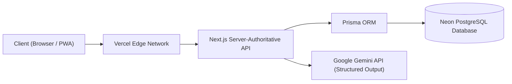

# Life-RPG

> **"Your life is the game. Real tasks. Real progress. Level up your real life."**

Life-RPG is a full-stack, server-authoritative web application that transforms daily routines, learning goals, fitness habits, and major projects into an engaging, retro-arcade role-playing progression system. Built with modern web performance, complete accessibility, and an authentic 80s/90s arcade CRT aesthetic, Life-RPG provides instant sensory feedback for real-world discipline.

---

## Table of Contents
- [Overview](#overview)
- [Why Life-RPG?](#why-life-rpg)
- [The Problem: Delayed Gratification](#the-problem-delayed-gratification)
- [The Solution & Core Gameplay Loop](#the-solution--core-gameplay-loop)
- [Key Features](#key-features)
- [What Makes It Different](#what-makes-it-different)
- [Competitor Context](#competitor-context)
- [Tech Stack](#tech-stack)
- [Architecture](#architecture)
- [Project Structure](#project-structure)
- [Database & Schema](#database--schema)
- [AI Game Master](#ai-game-master)
- [Local Setup & Installation](#local-setup--installation)
- [Environment Variables](#environment-variables)
- [Development Workflow](#development-workflow)
- [Testing Suite](#testing-suite)
- [Build & Production](#build--production)
- [Deployment](#deployment)
- [Security Architecture](#security-architecture)
- [Accessibility & Motion Safety](#accessibility--motion-safety)
- [UI Direction & Retro Arcade Aesthetics](#ui-direction--retro-arcade-aesthetics)
- [Demonstration Video](#demonstration-video)
- [GitHub Repository & Commits](#github-repository--commits)
- [Product Roadmap](#product-roadmap)
- [Contributing](#contributing)
- [License](#license)
- [Documentation Suite](#documentation-suite)

---

## Overview
Traditional to-do apps and productivity systems often feel like chores. They suffer from delayed gratification: studying, coding, or exercising yields results only after weeks or months of invisible effort. Games, by contrast, tap into human psychology with instant feedback, clear progression, visual growth, and tangible milestones.

Life-RPG bridges this psychological gap by turning real-world effort into server-verified XP, Gold, character level advancements, and attribute growth across six core life dimensions.

---

## Why Life-RPG?
Most gamified productivity tools fall into one of two traps:
1. **The Shame Spiral:** Missing a day destroys your streak or kills your avatar (e.g., Habitica, Beeminder), inducing guilt and causing users to abandon the app.
2. **Configuration Fatigue:** The application requires dozens of menus and manual stat-tuning before you can even track a single task (e.g., LifeUp).

Life-RPG enforces the **Low-Friction Principle**:
- **Action-First:** Add and complete quests in seconds with instant optimistic UI feedback.
- **Compassionate Re-engagement:** If you step away for days, the game pauses gracefully. You are greeted with a single, gentle **Recovery Quest** rather than a wall of shame.
- **AI Procedural Generation:** Turn messy real-world goals (*"Learn Go and build a microservice"*) into balanced RPG campaigns in one click.

---

## The Problem: Delayed Gratification
- Real-world effort lacks immediate sensory payoff.
- Procrastination thrives on monolithic, ambiguous projects.
- Standard spreadsheet-like SaaS dashboards drain motivation.

---

## The Solution & Core Gameplay Loop
```
REAL-LIFE GOAL
      ↓
QUEST / MILESTONE
      ↓
DO THE REAL WORK
      ↓
COMPLETE ACTION (OPTIMISTIC UI)
      ↓
SERVER-AUTHORITATIVE VERIFICATION
      ↓
XP + GOLD + ATTRIBUTE PROGRESSION
      ↓
NON-LINEAR LEVEL UP / REWARD UNLOCK
      ↓
REAL-WORLD PERSONAL GROWTH
```

---

## Key Features
- **Secure Multi-User Isolation:** Multi-device synchronization with encrypted HTTP-only session cookies and strict tenant data isolation.
- **Task & Quest Management (CRUD):** Fast, keyboard-navigable creation, filtering, updating, and completion of real-world quests.
- **Non-Linear RPG Progression:** Mathematically balanced leveling curves where each level requires scaling effort: $\text{XP}_{\text{required}}(L) = \lfloor 100 \times L^{1.5} \rfloor$.
- **6 Balanced Character Attributes:** Categorize quests into Strength (`STR`), Intellect (`INT`), Wisdom (`WIS`), Discipline (`DEX`), Creativity (`CRE`), and Charisma (`CHA`).
- **Real-Life Boss Battles:** Structure intimidating, multi-stage projects (e.g., thesis, capstones, marathons) into high-stakes boss battles where deliverables deal direct HP damage.
- **Gold Economy & Virtual Rewards Shop:** Earn Gold through verified effort to unlock retro CRT themes, pixel badges, sound packs, or custom real-world rewards.
- **Momentum & Graceful Recovery:** Rolling 7-day weighted momentum rating and shame-free recovery quests for returning players.
- **AI Game Master:** Powered by Google Gemini with strict JSON schema enforcement to procedurally convert user goals into structured campaigns.

---

## What Makes It Different
1. **The 70/20/10 Aesthetic Ratio:** 70% modern clean usable UX, 20% retro arcade cabinet identity, and 10% game magic (micro-interactions, particle explosions, tactile audio).
2. **Server-Authoritative Anti-Cheat:** The client is never trusted to calculate XP, Gold, or Levels. All progression logic is executed inside atomic database transactions.
3. **Compassionate Continuity:** Streaks pause instead of brutally breaking. Momentum softens the blow of busy weekends.

---

## Competitor Context
| Product | Positioning | Life-RPG Advantage |
| :--- | :--- | :--- |
| **Habitica** | Pixel RPG habit tracker | Eliminates punitive party damage; modern responsive UX; server-side anti-cheat. |
| **Todoist Karma** | Enterprise task list | Replaces meaningless point counters with a genuine character sheet, shop, and boss battles. |
| **LifeUp** | Android gamified tasks | Web-native cross-device sync; zero configuration fatigue via AI campaign generator. |
| **Finch** | Mental health pet | Adds serious project management, boss battles, and developer/professional workflows. |

---

## Tech Stack
- **Frontend Framework:** Next.js 14+ (App Router) with React 18 & TypeScript 5.x
- **Styling:** Tailwind CSS + Custom Arcade Design Tokens & CRT CSS Shaders
- **Animations:** Framer Motion + Canvas Confetti
- **State & Data Fetching:** Zustand (UI state) + TanStack Query v5 (Optimistic updates & cache)
- **Backend Runtime:** Next.js Serverless Route Handlers (Node.js/TypeScript)
- **Database & ORM:** PostgreSQL (Neon / Supabase) + Prisma ORM
- **Authentication:** NextAuth.js / Supabase Auth (Secure HTTP-only JWT sessions)
- **AI Intelligence:** Google Gemini API (`gemini-1.5-flash`) with Structured JSON Schemas
- **Testing:** Vitest, Supertest, Playwright, axe-core
- **Hosting & Edge:** Vercel Edge Network + Neon Serverless PostgreSQL

---

## Architecture


---

## Project Structure
```
Life-RPG/
├── docs/                          # Comprehensive Canonical Documentation
│   ├── 01-features.md             # Complete feature specification & competitor analysis
│   ├── 02-tech-stack.md           # Architecture, technology selection & tradeoffs
│   ├── 03-database-schema.md      # PostgreSQL DDL, Prisma schema & ERD
│   ├── 04-api-design.md           # RESTful API endpoints, request/response contracts
│   ├── 05-ai-integrations.md      # Gemini prompt architecture, schemas & fallbacks
│   ├── 06-ui-design.md            # Retro arcade design tokens, typography & components
│   ├── 07-implementation-phases.md # 14-phase implementation roadmap & milestones
│   └── 08-testing-strategy.md     # QA strategy, security test cases & demo checklist
├── prisma/
│   ├── schema.prisma              # Authoritative database model
│   └── migrations/                # Version-controlled database migrations
├── public/                        # Audio sprites, pixel fonts, and retro assets
├── src/
│   ├── app/                       # Next.js App Router (pages & API routes)
│   ├── components/                # Arcade UI components (CRT, HUD, Quests, Bosses)
│   ├── lib/                       # Progression math, database client, AI engine
│   └── types/                     # Shared TypeScript interfaces
├── .env.example                   # Environment variable template
├── package.json                   # Dependencies and scripts
└── tailwind.config.ts             # Arcade color tokens and visual configurations
```

---

## Database & Schema
The persistence layer runs on PostgreSQL managed via Prisma ORM:
- **`users` & `profiles`:** Identity, character stats, total XP, level, Gold, streaks, and active theme.
- **`attributes`:** Independent XP tracks for `STR`, `INT`, `WIS`, `DEX`, `CRE`, and `CHA`.
- **`tasks` & `task_completions`:** Quests and append-only completion records for idempotency.
- **`bosses` & `boss_milestones`:** Real-world projects modeled as boss health bars.
- **`items` & `inventory`:** Virtual rewards shop catalog and player-owned cosmetics.
- **`xp_transactions`:** Immutable audit ledger of all XP and Gold adjustments.

For complete SQL schema and ERD diagrams, refer to [03-database-schema.md](file:///Users/prateekpd/Projects/IIT%20BBSR/Life-RPG/docs/03-database-schema.md).

---

## AI Game Master
The AI Game Master uses Google Gemini (`gemini-1.5-flash`) with **Structured Outputs** (`responseSchema`) to enforce deterministic JSON payloads. It assists with:
1. **Goal-to-Campaign:** Decomposes broad goals into chapters and daily quests.
2. **Project-to-Boss:** Allocates deliverable milestones and HP damage.
3. **Recovery Quests:** Produces gentle inertia-breaking tasks for inactive users.
4. **Safety Rule:** AI models produce proposals only; they **never** have direct write access to user stats, wallets, or levels without validated server-side logic.

For complete prompt architectures and fallback logic, refer to [05-ai-integrations.md](file:///Users/prateekpd/Projects/IIT%20BBSR/Life-RPG/docs/05-ai-integrations.md).

---

## Local Setup & Installation

### Prerequisites
- Node.js $\ge 18.17.0$
- npm or pnpm
- A running PostgreSQL database (local or cloud via Neon/Supabase)
- A Google Gemini API key

### 1. Clone & Install
```bash
git clone https://github.com/[YOUR-ORGANIZATION]/life-rpg.git
cd life-rpg
npm install
```

### 2. Configure Environment
```bash
cp .env.example .env
```
Edit `.env` and provide your database connection string and Gemini API key.

### 3. Initialize Database & Seed
```bash
npx prisma migrate dev --name init
npx prisma db seed
```

### 4. Run Development Server
```bash
npm run dev
```
Open [http://localhost:3000](http://localhost:3000) in your browser.

---

## Environment Variables
See [.env.example](file:///Users/prateekpd/Projects/IIT%20BBSR/Life-RPG/.env.example) for exact variable keys:
- `DATABASE_URL`: Connection pooled PostgreSQL connection string.
- `DIRECT_URL`: Direct PostgreSQL connection string for Prisma migrations.
- `NEXTAUTH_SECRET`: Cryptographic secret for signing session cookies.
- `NEXTAUTH_URL`: Canonical application URL (e.g., `http://localhost:3000`).
- `GEMINI_API_KEY`: Google Gemini API key.

---

## Development Workflow
- **Linting:** `npm run lint`
- **Typechecking:** `npx tsc --noEmit`
- **Database Studio:** `npx prisma studio` (Visual GUI to inspect database state)

---

## Testing Suite
Execute automated unit and integration tests covering progression math, API routes, and idempotency:
```bash
# Run unit & integration test suite
npm run test

# Run end-to-end tests with Playwright
npm run test:e2e

# Run accessibility audits
npm run test:a11y
```

---

## Build & Production
To create an optimized production build:
```bash
npm run build
npm run start
```

---

## Deployment
Life-RPG is architected for zero-downtime deployment on **Vercel** connected to a serverless **Neon/Supabase PostgreSQL** database.
1. Connect your GitHub repository to Vercel.
2. Add your environment variables in the Vercel Project Settings.
3. Configure build command: `prisma generate && next build`.
4. Deploy!

---

## Security Architecture
- **Server-Authoritative Rewards:** All XP, Gold, and Levels are calculated server-side; client manipulation attempts are rejected.
- **Tenant Isolation:** Every query enforces strict user ownership checks.
- **Idempotency Locks:** Composite keys prevent duplicate task completion or double-rewards.
- **Secure Sessions:** Encrypted HTTP-only cookies protect against XSS token extraction.

---

## Accessibility & Motion Safety
- **100% Keyboard Navigable:** Full operation via `Tab`, `Shift+Tab`, `Enter`, `Space`, and `Esc`.
- **Screen Reader Friendly:** Semantic HTML5 landmarks with ARIA live regions for celebratory announcements.
- **Reduced Motion Support:** Respects `prefers-reduced-motion` by cleanly disabling CRT scanlines, screen-shake effects, and confetti.

---

## UI Direction & Retro Arcade Aesthetics
The design merges the tactile nostalgia of classic 80s/90s arcade cabinets with the speed of modern web applications:
- **Typography:** Pixel fonts (`Press Start 2P`, `Silkscreen`) for HUD scores and headers paired with clean sans-serif typography (`Outfit`) for readable quest text.
- **Color Palette:** High-contrast neon accents (Cyan `#00F0FF`, Magenta `#FF2A85`, Gold `#FFE600`) over deep space black (`#0B0C16`).
- **CRT Bezel & Scanlines:** Hardware-accelerated CSS overlays mimicking a curved glass monitor.
- **Handheld Adaptation:** On mobile devices, the interface transforms into a retro handheld console with touch-friendly 48px controls.

For complete color tokens and component specs, refer to [06-ui-design.md](file:///Users/prateekpd/Projects/IIT%20BBSR/Life-RPG/docs/06-ui-design.md).

---

## Demonstration Video
The mandatory submission walkthrough video must strictly adhere to the following parameters:
- **Duration:** Between 90 and 180 seconds (1:30 to 3:00).
- **File Size:** Under 100 MB.
- **Story Flow:** User signup/login $\to$ Task creation $\to$ Task completion with celebratory feedback $\to$ Level up $\to$ **Hard page refresh proving database persistence** $\to$ Signature feature showcase (Boss battle or AI campaign).
- **Access:** Publicly viewable link without requiring login credentials.

---

## GitHub Repository & Commits
In strict compliance with evaluation criteria:
- The repository must remain public.
- The Git history must contain **at least 3 clean, chronological commits** reflecting natural development progression (e.g., scaffolding $\to$ database/auth $\to$ features/UI).
- Includes comprehensive `README.md` and complete environment templates.

---

## Product Roadmap
- **Phase 1 (MVP):** Auth, Task CRUD, Non-linear XP, Attributes, Streaks, Rewards Shop, Responsive Arcade UI.
- **Phase 2 (Differentiators):** AI Game Master campaign generator, Real-Life Boss battles, Momentum rating, Recovery quests.
- **Phase 3 (Post-MVP):** Evolving visual pixel realm, Pomodoro focus timer, custom player self-rewards.
- **Phase 4 (Expansion):** Guilds, cooperative party boss battles, multiplayer quest challenges.

---

## Contributing
1. Fork the repository.
2. Create your feature branch (`git checkout -b feature/epic-quest-system`).
3. Commit your changes (`git commit -m 'feat: add epic quest system'`).
4. Push to the branch (`git push origin feature/epic-quest-system`).
5. Open a Pull Request.

---

## License
Distributed under the MIT License. See `LICENSE` for more information.

---

## Documentation Suite
For exhaustive architectural details, consult the canonical documentation package:
- [01-features.md](file:///Users/prateekpd/Projects/IIT%20BBSR/Life-RPG/docs/01-features.md) — Product Feature Specification & Competitor Analysis
- [02-tech-stack.md](file:///Users/prateekpd/Projects/IIT%20BBSR/Life-RPG/docs/02-tech-stack.md) — Technical Architecture & Stack Evaluation
- [03-database-schema.md](file:///Users/prateekpd/Projects/IIT%20BBSR/Life-RPG/docs/03-database-schema.md) — PostgreSQL Schema, Prisma Models & ERD
- [04-api-design.md](file:///Users/prateekpd/Projects/IIT%20BBSR/Life-RPG/docs/04-api-design.md) — RESTful API Contracts & Endpoints
- [05-ai-integrations.md](file:///Users/prateekpd/Projects/IIT%20BBSR/Life-RPG/docs/05-ai-integrations.md) — AI Game Master & Gemini Integration
- [06-ui-design.md](file:///Users/prateekpd/Projects/IIT%20BBSR/Life-RPG/docs/06-ui-design.md) — Retro Arcade Design System & Components
- [07-implementation-phases.md](file:///Users/prateekpd/Projects/IIT%20BBSR/Life-RPG/docs/07-implementation-phases.md) — 14-Phase Implementation Roadmap
- [08-testing-strategy.md](file:///Users/prateekpd/Projects/IIT%20BBSR/Life-RPG/docs/08-testing-strategy.md) — QA, Security Testing & Video Checklist
