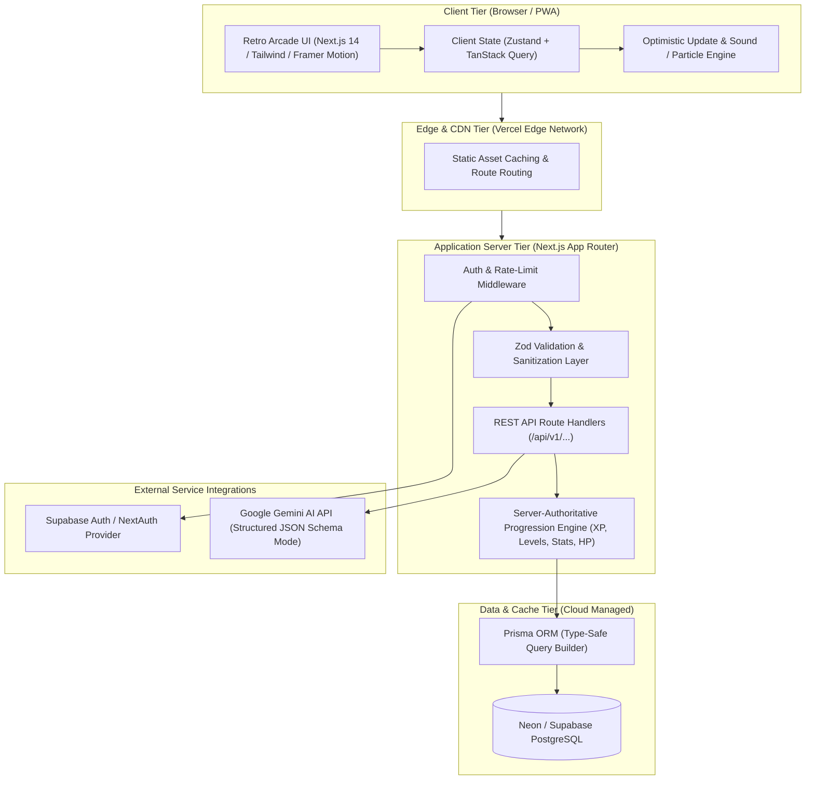

# LIFE-RPG: Technical Architecture & Stack Specification

> **Document Version:** 1.0.0  
> **Status:** Canonical Technical Architecture Specification  
> **Author:** Full-Stack Architect, Security Engineer & Tech Lead  
> **Last Updated:** 2026-09-12  

---

## 1. System Architecture Overview

Life-RPG is engineered as a modern, high-performance, server-authoritative web application. It combines low-latency frontend reactivity with strict backend data integrity to ensure that character progression, virtual economy transactions, and task completions are mathematically sound, secure against tampering, and resilient across devices.



---

## 2. Technology Stack Selection & Tradeoff Analysis

`[TECHNICAL DECISION]`

| Layer | Chosen Technology | Alternatives Considered | Selection Rationale & Tradeoffs |
| :--- | :--- | :--- | :--- |
| **Framework** | **Next.js 14+ (App Router)** | Vite + React SPA, SvelteKit, Remix | **Winner: Next.js.** Provides seamless full-stack cohesion (frontend + serverless API routes in one unified codebase), server-side rendering for ultra-fast LCP, built-in route handlers, and frictionless zero-config deployment to Vercel. Tradeoff: App Router learning curve. |
| **Language** | **TypeScript 5.x** | Pure JavaScript | **Winner: TypeScript.** End-to-end type safety from database schema (via Prisma) to API payloads and UI components. Eliminates runtime null pointer errors and guarantees data contract consistency. |
| **Styling** | **Tailwind CSS + Custom CSS Variables** | SCSS Modules, Styled Components | **Winner: Tailwind CSS.** Extremely fast development, zero runtime overhead, unified token system for retro neon colors and CRT effects, and built-in purge mechanisms yielding tiny CSS bundles ($<25\text{ KB}$). |
| **Animation** | **Framer Motion + Canvas Confetti** | GSAP, Pure CSS Transitions | **Winner: Framer Motion.** Declarative layout transitions, spring physics for tactile arcade buttons, exit animations for completed quests, and native support for `prefers-reduced-motion`. |
| **Data Fetching** | **TanStack Query (React Query v5)** | SWR, Redux Toolkit, useEffect | **Winner: TanStack Query.** Essential for **optimistic UI updates** (making tasks check off instantly before the server round-trip finishes), automatic background revalidation, and intelligent caching. |
| **Client State** | **Zustand** | Redux, Context API, MobX | **Winner: Zustand.** Minimal boilerplate ($<1\text{ KB}$), unopinionated store for transient UI state (active theme, audio mute toggle, modal states, CRT scanline toggle). |
| **Database** | **PostgreSQL (v15+)** | MongoDB, MySQL, SQLite | **Winner: PostgreSQL.** Complex relationships (Users $\to$ Quests $\to$ Attributes $\to$ Bosses $\to$ Transactions) require strict relational integrity, ACID transactions, row-level locking for currency balances, and rich indexing. SQLite is inadequate for multi-user serverless concurrency; MongoDB lacks transactional rigor. |
| **ORM** | **Prisma ORM** | Drizzle ORM, TypeORM, Raw SQL | **Winner: Prisma.** Auto-generated TypeScript types directly synchronized with PostgreSQL schema, robust database migration tooling (`prisma migrate`), and safe parameterized query execution preventing SQL injection. |
| **Authentication** | **NextAuth.js (Auth.js) / Supabase Auth** | Custom JWT, Clerk, Firebase | **Winner: NextAuth / Supabase Auth.** Standardized OAuth and email/password authentication, issuing encrypted, HTTP-only, `SameSite=Lax` session cookies. Protects against XSS token theft. |
| **Validation** | **Zod** | Yup, Joi, Valibot | **Winner: Zod.** First-class TypeScript type inference. Used identically across frontend form inputs and backend API route request parsing, rejecting malformed payloads at the perimeter. |
| **AI Engine** | **Google Gemini API (`gemini-1.5-flash`)** | OpenAI GPT-4o-mini, Anthropic Claude | **Winner: Gemini API.** Fast inference times ($<1.2\text{ s}$), cost-efficient, and native support for strict JSON schema enforcement (`responseSchema`), preventing hallucinated formats when generating quests. |
| **Deployment** | **Vercel + Neon/Supabase Postgres** | AWS EC2/ECS, Render, Railway | **Winner: Vercel + Neon.** Zero-downtime automated Git deployments, edge caching, instant preview URLs, and high-availability serverless PostgreSQL with connection pooling. |

---

## 3. Server-Authoritative Progression & Security Architecture

`[SOURCE REQUIREMENT] & [TECHNICAL DECISION]`

### 3.1 Zero-Trust Client Model
The frontend client is strictly treated as an untrusted rendering surface. Under **no circumstances** does the backend accept client-provided values for:
- Experience Points (`xp`)
- Currency / Gold (`gold`)
- Character Level (`level`)
- Attribute Stat Points (`attribute_xp`)
- Boss Damage (`hp_damage`)
- Achievement Unlocks (`achievement_id`)

#### Completion Flow Architecture:
```
Client Action:
User clicks "Complete Quest" [Task ID: 481a]
       │
       ▼
HTTP POST /api/v1/tasks/481a/complete
Headers: { Authorization: Bearer <cookie>, Idempotency-Key: <uuid> }
Payload: {} (EMPTY - No stats sent!)
       │
       ▼
Backend Verification:
1. Authenticate user session from secure HTTP-only cookie.
2. Verify Task 481a exists and belongs strictly to session.userId.
3. Check Task status: if already COMPLETED, return 409 Conflict.
4. Begin ACID Transaction:
   a. Mark Task 481a as COMPLETED in database.
   b. Lookup authoritative base XP & Gold from server difficulty config.
   c. Add XP and Gold to user's profile and character record.
   d. Increment matching Attribute XP (e.g., INT += 50).
   e. Recalculate Level: newLevel = calculateLevel(totalXP).
   f. Record audit entry in `xp_transactions` ledger.
   g. Evaluate streak & momentum updates.
   h. Check if any Boss milestones were linked to this task.
5. Commit Transaction.
       │
       ▼
HTTP 200 OK Response:
{
  "success": true,
  "data": {
    "awardedXp": 50,
    "awardedGold": 25,
    "newTotalXp": 432,
    "newLevel": 3,
    "didLevelUp": true,
    "attributeUpdates": { "INT": 50 },
    "streak": 5,
    "bossDamage": null
  }
}
```

### 3.2 Security Protections
1. **CSRF Protection:** Next.js Route Handlers validate origin headers on state-mutating requests (`POST`, `PUT`, `PATCH`, `DELETE`). Session cookies are strictly configured with `SameSite=Lax` (or `Strict`).
2. **SQL Injection Prevention:** 100% of database queries are executed via Prisma's parameterized query engine. No raw string concatenation is permitted.
3. **XSS Protection:** Content rendered in the UI (quest titles, notes) is sanitized. Markdown formatting is rendered using `react-markdown` with strict sanitization (`rehype-sanitize`).
4. **Rate Limiting:** IP and user-level sliding window rate limits (e.g., maximum 60 task completions per minute, 5 AI quest generations per hour) enforced via Upstash Redis or in-memory token bucket middleware.
5. **Session Management:** Cryptographically signed session tokens with a 7-day rolling expiration. Absolute timeout forced after 30 days.

---

## 4. Repository & Directory Structure

Life-RPG is structured as a clean, modular, production-ready full-stack monorepo inside the Next.js App Router framework:

```
Life-RPG/
├── README.md                          # Master developer README & setup guide
├── docs/                              # Canonical documentation suite
│   ├── 01-features.md
│   ├── 02-tech-stack.md
│   ├── 03-database-schema.md
│   ├── 04-api-design.md
│   ├── 05-ai-integrations.md
│   ├── 06-ui-design.md
│   ├── 07-implementation-phases.md
│   └── 08-testing-strategy.md
├── prisma/
│   ├── schema.prisma                  # Authoritative Prisma schema definition
│   ├── migrations/                    # Automated database migrations
│   └── seed.ts                        # Development database seeder
├── public/
│   ├── audio/                         # Retro 8-bit sound effects (sfx_levelup.wav, etc.)
│   ├── fonts/                         # Pixel & modern web font assets
│   └── icons/                         # SVG retro arcade badges and items
├── src/
│   ├── app/                           # Next.js App Router
│   │   ├── (auth)/                    # Auth route group (login, register)
│   │   │   ├── login/page.tsx
│   │   │   └── register/page.tsx
│   │   ├── (dashboard)/               # Authenticated application route group
│   │   │   ├── page.tsx               # Primary Arcade Dashboard
│   │   │   ├── quests/page.tsx        # Quests & Habits Management
│   │   │   ├── bosses/page.tsx        # Real-Life Boss Battles
│   │   │   ├── character/page.tsx     # Character Sheet & Stats Radar
│   │   │   ├── shop/page.tsx          # Virtual Rewards & Item Catalog
│   │   │   └── settings/page.tsx      # User Profile & Preferences
│   │   ├── api/v1/                    # Server-Authoritative REST API Routes
│   │   │   ├── auth/[...nextauth]/route.ts
│   │   │   ├── character/route.ts
│   │   │   ├── tasks/
│   │   │   │   ├── route.ts           # GET (list), POST (create)
│   │   │   │   ├── [id]/route.ts      # GET, PATCH, DELETE
│   │   │   │   └── [id]/complete/route.ts # Authoritative completion
│   │   │   ├── bosses/route.ts
│   │   │   ├── shop/route.ts
│   │   │   └── ai/
│   │   │       ├── generate-campaign/route.ts
│   │   │       └── recovery-quest/route.ts
│   │   ├── layout.tsx                 # Root layout with CRT shader wrappers
│   │   └── globals.css                # Tailwind base + custom CRT scanline CSS
│   ├── components/                    # Modular Reusable UI Components
│   │   ├── arcade/                    # Arcade-Specific Thematic Components
│   │   │   ├── CrtOverlay.tsx         # Scanline & vignette visual shader
│   │   │   ├── ArcadeMarquee.tsx      # Glowing pixel marquee banner
│   │   │   ├── ArcadeButton.tsx       # 3D beveled tactile button
│   │   │   ├── XpProgressBar.tsx      # Segmented pixel XP gauge
│   │   │   └── SoundProvider.tsx      # Audio context & sound effects dispatcher
│   │   ├── quests/                    # Task & Quest Components
│   │   │   ├── QuestCard.tsx
│   │   │   ├── QuestList.tsx
│   │   │   └── QuestCreateModal.tsx
│   │   ├── bosses/                    # Boss Fight Components
│   │   │   ├── BossCard.tsx
│   │   │   └── BossHpBar.tsx
│   │   └── ui/                        # Accessible Core UI Primitives (Radix/Custom)
│   │       ├── Dialog.tsx
│   │       ├── Dropdown.tsx
│   │       └── Toast.tsx
│   ├── lib/                           # Core Utilities & Backend Engines
│   │   ├── db.ts                      # Prisma client singleton
│   │   ├── auth.ts                    # NextAuth / session helper
│   │   ├── progression.ts             # Server-side XP & Level math engine
│   │   ├── gemini.ts                  # Gemini AI client with JSON schema guardrails
│   │   └── sound.ts                   # Client-side Web Audio API synthesizer
│   └── types/                         # Global TypeScript Data Contracts
│       └── index.ts
├── .env.example                       # Canonical environment template
├── next.config.mjs                    # Next.js configuration
├── package.json                       # Dependencies and build scripts
├── tailwind.config.ts                 # Tailwind design tokens & retro colors
└── tsconfig.json                      # Strict TypeScript compiler options
```

---

## 5. Environment Variables Specification

`[SOURCE REQUIREMENT] & [TECHNICAL DECISION]`

The `.env.example` file must contain exact, clear placeholders for all required services:

```ini
# ==============================================================================
# LIFE-RPG CANONICAL ENVIRONMENT TEMPLATE (.env.example)
# ==============================================================================

# Database Connection (Neon / Supabase PostgreSQL)
# Direct connection string for migrations and pooled string for serverless API
DATABASE_URL="postgresql://postgres:[PASSWORD]@[HOST]:5432/liferpg?sslmode=require&pgbouncer=true"
DIRECT_URL="postgresql://postgres:[PASSWORD]@[HOST]:5432/liferpg?sslmode=require"

# NextAuth / Session Configuration
NEXTAUTH_URL="http://localhost:3000"
NEXTAUTH_SECRET="generate-with-openssl-rand-hex-32"

# OAuth Credentials (Optional for local development)
GITHUB_CLIENT_ID="your-github-client-id"
GITHUB_CLIENT_SECRET="your-github-client-secret"
GOOGLE_CLIENT_ID="your-google-client-id"
GOOGLE_CLIENT_SECRET="your-google-client-secret"

# AI Game Master Engine (Google Gemini API)
GEMINI_API_KEY="AIzaSyYourGeminiApiKeyHere"

# Application Settings & Security
NODE_ENV="development"
NEXT_PUBLIC_APP_URL="http://localhost:3000"
```

---

## 6. Performance, Optimization & Web Vitals Targets

`[SOURCE REQUIREMENT] & [DESIGN RECOMMENDATION]`

Life-RPG targets best-in-class Google Core Web Vitals to guarantee that heavy visual styling (CRT shaders, glowing pixels) never impacts fluidity or battery life:

| Metric | Target | Optimization Strategy |
| :--- | :--- | :--- |
| **Largest Contentful Paint (LCP)** | $<1.2\text{ s}$ | Server-rendered initial dashboard state; critical fonts (`Press Start 2P`, `Outfit`) preloaded using `next/font` with `swap` display. |
| **Cumulative Layout Shift (CLS)** | $0.00$ | Strict fixed-aspect ratio bounding boxes on arcade cards, XP gauges, and avatar frames to prevent dynamic pop-in. |
| **Interaction to Next Paint (INP)** | $<80\text{ ms}$ | **Optimistic UI Updates** via TanStack Query. Tasks mark as completed and sound triggers within $<16\text{ ms}$ of user tap; server confirmation completes asynchronously in background. |
| **JavaScript Bundle Size** | $<90\text{ KB}$ (First Load JS) | Code-splitting non-critical modals (Boss Generator, AI modal, Shop) via dynamic imports (`next/dynamic`). |
| **CRT Shader Performance** | 60 FPS / GPU Accel | The scanline overlay is implemented using pure CSS repeating linear gradients with `pointer-events: none` and GPU hardware acceleration (`will-change: transform; transform: translateZ(0)`). Zero expensive CPU canvas loops. |

---

## 7. CI/CD Pipeline & Deployment Strategy

`[SOURCE REQUIREMENT]`

### 7.1 Automated Continuous Integration (GitHub Actions)
On every pull request and push to `main`:
1. **Typecheck:** `tsc --noEmit` verifies strict TypeScript contract compliance.
2. **Lint:** `eslint . --ext .ts,.tsx` enforces clean code style.
3. **Database Validation:** `prisma validate` checks schema consistency.
4. **Automated Unit & Integration Tests:** Executes Vitest/Jest suite covering the progression math, API route authorization, and idempotency locks.

### 7.2 Production Continuous Deployment (Vercel)
1. **Automated Deployment:** Commits to `main` trigger Vercel build pipelines with automatic Prisma schema compilation (`prisma generate`).
2. **Zero-Downtime Migrations:** Database migrations are run prior to traffic switching via `prisma migrate deploy`.
3. **Health Check Probe:** Vercel deploys are only routed to live visitors after `/api/health` returns `200 OK` verifying active database connectivity.
