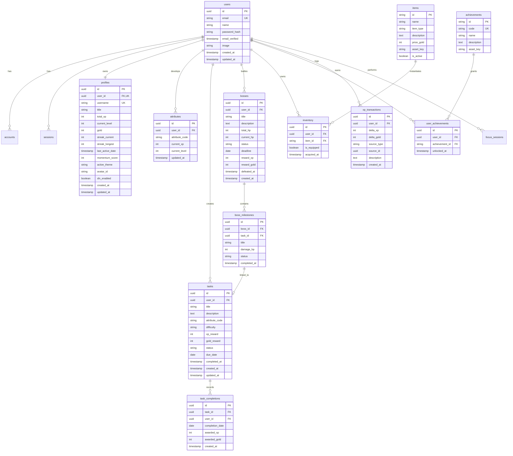

# LIFE-RPG: Database Architecture & Schema Specification

> **Document Version:** 1.0.0  
> **Status:** Canonical Database Specification  
> **Author:** Database Architect & Tech Lead  
> **Last Updated:** 2026-09-12  

---

## 1. Database Architecture Overview

The Life-RPG persistence tier is engineered on **PostgreSQL (v15+)** using **Prisma ORM**. 

The data architecture is structured around two distinct types of data:
1. **Authoritative Immutable Ledgers:** Append-only transaction tables (`xp_transactions`, `task_completions`, `activity_events`, `inventory`) that record every state change.
2. **Authoritative Materialized State:** Current cached character snapshots (`profiles`, `attributes`, `bosses`) updated strictly inside database transactions. If any cache inconsistency occurs, the character's total XP, Gold, Level, and Inventory can be perfectly replayed and audited from the immutable ledgers.

---

## 2. Entity-Relationship Diagram (ERD)



---

## 3. Data Dictionary & Table Definitions

`[TECHNICAL DECISION]`

### 3.1 `users`
Represents the core authenticated identity. Compatible with NextAuth / Supabase Auth standards.

| Column | Type | Constraints | Description |
| :--- | :--- | :--- | :--- |
| `id` | `UUID` | `PK, DEFAULT gen_random_uuid()` | Unique internal user identifier. |
| `email` | `VARCHAR(255)` | `UNIQUE, NOT NULL` | User email address. |
| `name` | `VARCHAR(100)` | `NULLABLE` | Display name. |
| `password_hash` | `TEXT` | `NULLABLE` | Argon2/Bcrypt hash (null for OAuth users). |
| `email_verified`| `TIMESTAMP` | `NULLABLE` | Verification timestamp. |
| `image` | `TEXT` | `NULLABLE` | Avatar image URL. |
| `created_at` | `TIMESTAMPTZ` | `NOT NULL, DEFAULT NOW()` | Record creation timestamp. |
| `updated_at` | `TIMESTAMPTZ` | `NOT NULL, DEFAULT NOW()` | Record update timestamp. |

### 3.2 `profiles`
The primary player character sheet containing authoritative progression snapshots.

| Column | Type | Constraints | Description |
| :--- | :--- | :--- | :--- |
| `id` | `UUID` | `PK, DEFAULT gen_random_uuid()` | Unique profile identifier. |
| `user_id` | `UUID` | `UNIQUE, NOT NULL, FK(users.id ON DELETE CASCADE)` | Foreign key link to user identity. |
| `username` | `VARCHAR(32)` | `UNIQUE, NOT NULL` | Distinct arcade player handle. |
| `title` | `VARCHAR(64)` | `NOT NULL, DEFAULT 'Novice Wanderer'` | Equipped character title. |
| `total_xp` | `INTEGER` | `NOT NULL, DEFAULT 0, CHECK(total_xp >= 0)` | Total accumulated player XP. |
| `current_level` | `INTEGER` | `NOT NULL, DEFAULT 1, CHECK(current_level >= 1)` | Current level calculated from `total_xp`. |
| `gold` | `INTEGER` | `NOT NULL, DEFAULT 0, CHECK(gold >= 0)` | Authoritative player wallet balance. |
| `streak_current`| `INTEGER` | `NOT NULL, DEFAULT 0` | Current active streak in consecutive days. |
| `streak_longest`| `INTEGER` | `NOT NULL, DEFAULT 0` | All-time highest streak achieved. |
| `last_active_date`| `DATE` | `NULLABLE` | Most recent date with verified quest activity. |
| `momentum_score`| `INTEGER` | `NOT NULL, DEFAULT 50, CHECK(momentum_score BETWEEN 0 AND 100)` | Rolling 7-day weighted momentum rating. |
| `active_theme` | `VARCHAR(32)` | `NOT NULL, DEFAULT 'synthwave'` | Active CRT colorway token. |
| `avatar_id` | `VARCHAR(32)` | `NOT NULL, DEFAULT 'pixel_knight'` | Equipped pixel avatar identifier. |
| `sfx_enabled` | `BOOLEAN` | `NOT NULL, DEFAULT true` | Retro 8-bit sound effects toggle. |
| `created_at` | `TIMESTAMPTZ` | `NOT NULL, DEFAULT NOW()` | Profile initialization timestamp. |
| `updated_at` | `TIMESTAMPTZ` | `NOT NULL, DEFAULT NOW()` | Profile last modified timestamp. |

- **Indexes:**
  - `CREATE INDEX idx_profiles_user_id ON profiles(user_id);`
  - `CREATE INDEX idx_profiles_current_level ON profiles(current_level DESC);`

### 3.3 `attributes`
Tracks progress across the 6 canonical real-life attributes.

| Column | Type | Constraints | Description |
| :--- | :--- | :--- | :--- |
| `id` | `UUID` | `PK, DEFAULT gen_random_uuid()` | Attribute record identifier. |
| `user_id` | `UUID` | `NOT NULL, FK(users.id ON DELETE CASCADE)` | Player reference. |
| `attribute_code`| `VARCHAR(3)` | `NOT NULL, CHECK(attribute_code IN ('STR', 'INT', 'WIS', 'DEX', 'CRE', 'CHA'))` | Canonical 3-letter attribute identifier. |
| `current_xp` | `INTEGER` | `NOT NULL, DEFAULT 0, CHECK(current_xp >= 0)` | Total XP earned under this attribute. |
| `current_level` | `INTEGER` | `NOT NULL, DEFAULT 1, CHECK(current_level >= 1)` | Attribute-specific sub-level. |
| `updated_at` | `TIMESTAMPTZ` | `NOT NULL, DEFAULT NOW()` | Last progress timestamp. |

- **Constraints & Indexes:**
  - `UNIQUE(user_id, attribute_code)`
  - `CREATE INDEX idx_attributes_user_code ON attributes(user_id, attribute_code);`

### 3.4 `tasks` (Quests)
Represents discrete player tasks and quests.

| Column | Type | Constraints | Description |
| :--- | :--- | :--- | :--- |
| `id` | `UUID` | `PK, DEFAULT gen_random_uuid()` | Unique quest identifier. |
| `user_id` | `UUID` | `NOT NULL, FK(users.id ON DELETE CASCADE)` | Owner user ID. |
| `title` | `VARCHAR(160)` | `NOT NULL` | Quest title (validated $\ge 1$ char). |
| `description` | `TEXT` | `NULLABLE` | Markdown notes or instructions. |
| `attribute_code`| `VARCHAR(3)` | `NOT NULL, FK` | Associated attribute (`STR`, `INT`, etc.). |
| `difficulty` | `VARCHAR(16)` | `NOT NULL, DEFAULT 'Medium', CHECK(difficulty IN ('Trivial', 'Easy', 'Medium', 'Hard', 'Epic'))` | Difficulty tier governing XP/Gold. |
| `xp_reward` | `INTEGER` | `NOT NULL, CHECK(xp_reward > 0)` | Base XP awarded upon verified completion. |
| `gold_reward` | `INTEGER` | `NOT NULL, CHECK(gold_reward >= 0)` | Base Gold awarded upon verified completion. |
| `status` | `VARCHAR(16)` | `NOT NULL, DEFAULT 'ACTIVE', CHECK(status IN ('ACTIVE', 'COMPLETED', 'ARCHIVED'))` | Lifecycle state. |
| `due_date` | `DATE` | `NULLABLE` | Optional target completion date. |
| `completed_at` | `TIMESTAMPTZ` | `NULLABLE` | Timestamp of completion. |
| `created_at` | `TIMESTAMPTZ` | `NOT NULL, DEFAULT NOW()` | Creation timestamp. |
| `updated_at` | `TIMESTAMPTZ` | `NOT NULL, DEFAULT NOW()` | Modification timestamp. |

- **Indexes:**
  - `CREATE INDEX idx_tasks_user_status ON tasks(user_id, status);`
  - `CREATE INDEX idx_tasks_user_due_date ON tasks(user_id, due_date);`

### 3.5 `task_completions` (Idempotency & Audit Log)
Guarantees duplicate completion prevention and supports historical activity graphing.

| Column | Type | Constraints | Description |
| :--- | :--- | :--- | :--- |
| `id` | `UUID` | `PK, DEFAULT gen_random_uuid()` | Unique event identifier. |
| `task_id` | `UUID` | `NOT NULL, FK(tasks.id ON DELETE CASCADE)` | Completed task identifier. |
| `user_id` | `UUID` | `NOT NULL, FK(users.id ON DELETE CASCADE)` | Player reference. |
| `completion_date`| `DATE` | `NOT NULL` | User-local calendar date of completion. |
| `awarded_xp` | `INTEGER` | `NOT NULL` | Actual XP granted after multipliers. |
| `awarded_gold` | `INTEGER` | `NOT NULL` | Actual Gold granted after multipliers. |
| `created_at` | `TIMESTAMPTZ` | `NOT NULL, DEFAULT NOW()` | Audit timestamp. |

- **Constraints & Indexes:**
  - `UNIQUE(task_id)`: Prevents single tasks from ever being credited twice.
  - `CREATE INDEX idx_completions_user_date ON task_completions(user_id, completion_date);`

### 3.6 `bosses` & `boss_milestones`
Structures large real-world projects as boss battles.

#### `bosses`
| Column | Type | Constraints | Description |
| :--- | :--- | :--- | :--- |
| `id` | `UUID` | `PK, DEFAULT gen_random_uuid()` | Unique boss battle identifier. |
| `user_id` | `UUID` | `NOT NULL, FK(users.id ON DELETE CASCADE)` | Owner player identifier. |
| `title` | `VARCHAR(120)` | `NOT NULL` | Project/Objective title (e.g., "Capstone"). |
| `description` | `TEXT` | `NULLABLE` | Boss lore or background context. |
| `total_hp` | `INTEGER` | `NOT NULL, CHECK(total_hp > 0)` | Maximum health pool (sum of milestones). |
| `current_hp` | `INTEGER` | `NOT NULL, CHECK(current_hp >= 0)` | Remaining boss health. |
| `status` | `VARCHAR(16)` | `NOT NULL, DEFAULT 'ACTIVE', CHECK(status IN ('ACTIVE', 'DEFEATED', 'ABANDONED'))` | Battle state. |
| `deadline` | `DATE` | `NULLABLE` | Target project completion deadline. |
| `reward_xp` | `INTEGER` | `NOT NULL, DEFAULT 500` | Victory bonus XP awarded upon defeat. |
| `reward_gold` | `INTEGER` | `NOT NULL, DEFAULT 250` | Victory bonus Gold awarded upon defeat. |
| `defeated_at` | `TIMESTAMPTZ` | `NULLABLE` | Timestamp when current_hp reached 0. |
| `created_at` | `TIMESTAMPTZ` | `NOT NULL, DEFAULT NOW()` | Battle creation timestamp. |

#### `boss_milestones`
| Column | Type | Constraints | Description |
| :--- | :--- | :--- | :--- |
| `id` | `UUID` | `PK, DEFAULT gen_random_uuid()` | Milestone identifier. |
| `boss_id` | `UUID` | `NOT NULL, FK(bosses.id ON DELETE CASCADE)` | Parent boss battle. |
| `task_id` | `UUID` | `NULLABLE, FK(tasks.id ON DELETE SET NULL)` | Optional linked task in quest list. |
| `title` | `VARCHAR(160)` | `NOT NULL` | Milestone deliverable title. |
| `damage_hp` | `INTEGER` | `NOT NULL, CHECK(damage_hp > 0)` | Damage inflicted on boss when done. |
| `status` | `VARCHAR(16)` | `NOT NULL, DEFAULT 'PENDING', CHECK(status IN ('PENDING', 'COMPLETED'))` | Completion status. |
| `completed_at` | `TIMESTAMPTZ` | `NULLABLE` | Timestamp when milestone cleared. |

### 3.7 In-Game Economy: `items` & `inventory`

#### `items` (Catalog)
| Column | Type | Constraints | Description |
| :--- | :--- | :--- | :--- |
| `id` | `VARCHAR(64)` | `PK` | Static item key (e.g., `theme_gameboy`). |
| `name` | `VARCHAR(100)` | `NOT NULL` | Thematic item display name. |
| `item_type` | `VARCHAR(24)` | `NOT NULL, CHECK(item_type IN ('THEME', 'BADGE', 'SOUNDPACK', 'CUSTOM_REWARD'))` | Item category. |
| `description` | `TEXT` | `NOT NULL` | Description and flavor text. |
| `price_gold` | `INTEGER` | `NOT NULL, CHECK(price_gold >= 0)` | Gold cost in shop. |
| `asset_key` | `VARCHAR(64)` | `NOT NULL` | CSS token or SVG asset reference. |
| `is_active` | `BOOLEAN` | `NOT NULL, DEFAULT true` | Catalog visibility toggle. |

#### `inventory` (User Owned Items)
| Column | Type | Constraints | Description |
| :--- | :--- | :--- | :--- |
| `id` | `UUID` | `PK, DEFAULT gen_random_uuid()` | Record identifier. |
| `user_id` | `UUID` | `NOT NULL, FK(users.id ON DELETE CASCADE)` | Owner player ID. |
| `item_id` | `VARCHAR(64)` | `NOT NULL, FK(items.id ON DELETE CASCADE)` | Purchased item identifier. |
| `is_equipped` | `BOOLEAN` | `NOT NULL, DEFAULT false` | Currently active on character. |
| `acquired_at` | `TIMESTAMPTZ` | `NOT NULL, DEFAULT NOW()` | Purchase timestamp. |

- **Constraints:** `UNIQUE(user_id, item_id)` (Cosmetics are one-time unlocks).

### 3.8 `xp_transactions` (Authoritative Audit Ledger)
Every fluctuation in character XP or Gold writes an immutable record to this ledger.

| Column | Type | Constraints | Description |
| :--- | :--- | :--- | :--- |
| `id` | `UUID` | `PK, DEFAULT gen_random_uuid()` | Unique transaction ID. |
| `user_id` | `UUID` | `NOT NULL, FK(users.id ON DELETE CASCADE)` | Player ID. |
| `delta_xp` | `INTEGER` | `NOT NULL` | XP adjustment (+50, +250, etc.). |
| `delta_gold` | `INTEGER` | `NOT NULL` | Gold adjustment (+25, -150 for purchases). |
| `source_type` | `VARCHAR(32)` | `NOT NULL, CHECK(source_type IN ('TASK_COMPLETE', 'BOSS_VICTORY', 'SHOP_PURCHASE', 'RECOVERY_BONUS'))` | System origin. |
| `source_id` | `UUID` | `NULLABLE` | Foreign key to task_id, boss_id, or item_id. |
| `description` | `VARCHAR(255)` | `NOT NULL` | Human-readable audit explanation. |
| `created_at` | `TIMESTAMPTZ` | `NOT NULL, DEFAULT NOW()` | Transaction execution timestamp. |

- **Indexes:**
  - `CREATE INDEX idx_xp_transactions_user ON xp_transactions(user_id, created_at DESC);`

### 3.9 `achievements` (Catalog Table)
Defines unlockable badges, milestone achievements, and honorary titles.

| Column | Type | Constraints | Description |
| :--- | :--- | :--- | :--- |
| `id` | `VARCHAR(64)` | `PK` | Unique achievement identifier (e.g. `boss_slayer`). |
| `code` | `VARCHAR(64)` | `UNIQUE, NOT NULL` | Standardized uppercase lookup code (e.g. `TITAN_SLAYER`). |
| `name` | `VARCHAR(100)` | `NOT NULL` | Display name (e.g. "Titan Slayer"). |
| `description` | `TEXT` | `NOT NULL` | Unlock criteria explanation. |
| `asset_key` | `VARCHAR(64)` | `NOT NULL` | Sprite/icon asset identifier. |

### 3.10 `user_achievements`
Join table recording unlocked player achievements.

| Column | Type | Constraints | Description |
| :--- | :--- | :--- | :--- |
| `id` | `UUID` | `PK, DEFAULT gen_random_uuid()` | Unique record ID. |
| `user_id` | `UUID` | `NOT NULL, FK(users.id ON DELETE CASCADE)` | Unlocking player ID. |
| `achievement_id` | `VARCHAR(64)` | `NOT NULL, FK(achievements.id ON DELETE CASCADE)` | Achievement ID. |
| `unlocked_at` | `TIMESTAMPTZ` | `NOT NULL, DEFAULT NOW()` | Unlock timestamp. |

- **Constraints:** `UNIQUE(user_id, achievement_id)`

---

## 4. Canonical Prisma Schema (`schema.prisma`)

```prisma
datasource db {
  provider  = "postgresql"
  url       = env("DATABASE_URL")
  directUrl = env("DIRECT_URL")
}

generator client {
  provider = "prisma-client-js"
}

model User {
  id             String          @id @default(uuid())
  email          String          @unique
  name           String?
  passwordHash   String?         @map("password_hash")
  emailVerified  DateTime?       @map("email_verified")
  image          String?
  createdAt      DateTime        @default(now()) @map("created_at")
  updatedAt      DateTime        @updatedAt @map("updated_at")

  profile        Profile?
  attributes     Attribute[]
  tasks          Task[]
  taskCompletions TaskCompletion[]
  bosses         Boss[]
  inventory      Inventory[]
  achievements   UserAchievement[]
  xpTransactions XpTransaction[]
  focusSessions  FocusSession[]

  @@map("users")
}

model Profile {
  id              String    @id @default(uuid())
  userId          String    @unique @map("user_id")
  username        String    @unique
  title           String    @default("Novice Wanderer")
  totalXp         Int       @default(0) @map("total_xp")
  currentLevel    Int       @default(1) @map("current_level")
  gold            Int       @default(0)
  streakCurrent   Int       @default(0) @map("streak_current")
  streakLongest   Int       @default(0) @map("streak_longest")
  lastActiveDate  DateTime? @map("last_active_date") @db.Date
  momentumScore   Int       @default(50) @map("momentum_score")
  activeTheme     String    @default("synthwave") @map("active_theme")
  avatarId        String    @default("pixel_knight") @map("avatar_id")
  sfxEnabled      Boolean   @default(true) @map("sfx_enabled")
  createdAt       DateTime  @default(now()) @map("created_at")
  updatedAt       DateTime  @updatedAt @map("updated_at")

  user            User      @relation(fields: [userId], references: [id], onDelete: Cascade)

  @@map("profiles")
}

model Attribute {
  id            String   @id @default(uuid())
  userId        String   @map("user_id")
  attributeCode String   @map("attribute_code")
  currentXp     Int      @default(0) @map("current_xp")
  currentLevel  Int      @default(1) @map("current_level")
  updatedAt     DateTime @updatedAt @map("updated_at")

  user          User     @relation(fields: [userId], references: [id], onDelete: Cascade)

  @@unique([userId, attributeCode])
  @@map("attributes")
}

model Task {
  id             String          @id @default(uuid())
  userId         String          @map("user_id")
  title          String
  description    String?         @db.Text
  attributeCode  String          @map("attribute_code")
  difficulty     String          @default("Medium")
  xpReward       Int             @map("xp_reward")
  goldReward     Int             @map("gold_reward")
  status         String          @default("ACTIVE")
  dueDate        DateTime?       @map("due_date") @db.Date
  completedAt    DateTime?       @map("completed_at")
  createdAt      DateTime        @default(now()) @map("created_at")
  updatedAt      DateTime        @updatedAt @map("updated_at")

  user           User            @relation(fields: [userId], references: [id], onDelete: Cascade)
  completions    TaskCompletion?
  bossMilestone  BossMilestone?

  @@index([userId, status])
  @@map("tasks")
}

model TaskCompletion {
  id             String   @id @default(uuid())
  taskId         String   @unique @map("task_id")
  userId         String   @map("user_id")
  completionDate DateTime @map("completion_date") @db.Date
  awardedXp      Int      @map("awarded_xp")
  awardedGold    Int      @map("awarded_gold")
  createdAt      DateTime @default(now()) @map("created_at")

  task           Task     @relation(fields: [taskId], references: [id], onDelete: Cascade)
  user           User     @relation(fields: [userId], references: [id], onDelete: Cascade)

  @@index([userId, completionDate])
  @@map("task_completions")
}

model Boss {
  id          String          @id @default(uuid())
  userId      String          @map("user_id")
  title       String
  description String?         @db.Text
  totalHp     Int             @map("total_hp")
  currentHp   Int             @map("current_hp")
  status      String          @default("ACTIVE")
  deadline    DateTime?       @db.Date
  rewardXp    Int             @default(500) @map("reward_xp")
  rewardGold  Int             @default(250) @map("reward_gold")
  defeatedAt  DateTime?       @map("defeated_at")
  createdAt   DateTime        @default(now()) @map("created_at")

  user        User            @relation(fields: [userId], references: [id], onDelete: Cascade)
  milestones  BossMilestone[]

  @@map("bosses")
}

model BossMilestone {
  id          String    @id @default(uuid())
  bossId      String    @map("boss_id")
  taskId      String?   @unique @map("task_id")
  title       String
  damageHp    Int       @map("damage_hp")
  status      String    @default("PENDING")
  completedAt DateTime? @map("completed_at")

  boss        Boss      @relation(fields: [bossId], references: [id], onDelete: Cascade)
  task        Task?     @relation(fields: [taskId], references: [id], onDelete: SetNull)

  @@map("boss_milestones")
}

model Item {
  id          String      @id
  name        String
  itemType    String      @map("item_type")
  description String      @db.Text
  priceGold   Int         @map("price_gold")
  assetKey    String      @map("asset_key")
  isActive    Boolean     @default(true) @map("is_active")

  inventory   Inventory[]

  @@map("items")
}

model Inventory {
  id         String   @id @default(uuid())
  userId     String   @map("user_id")
  itemId     String   @map("item_id")
  isEquipped Boolean  @default(false) @map("is_equipped")
  acquiredAt DateTime @default(now()) @map("acquired_at")

  user       User     @relation(fields: [userId], references: [id], onDelete: Cascade)
  item       Item     @relation(fields: [itemId], references: [id], onDelete: Cascade)

  @@unique([userId, itemId])
  @@map("inventory")
}

model XpTransaction {
  id          String   @id @default(uuid())
  userId      String   @map("user_id")
  deltaXp     Int      @map("delta_xp")
  deltaGold   Int      @map("delta_gold")
  sourceType  String   @map("source_type")
  sourceId    String?  @map("source_id")
  description String
  createdAt   DateTime @default(now()) @map("created_at")

  user        User     @relation(fields: [userId], references: [id], onDelete: Cascade)

  @@index([userId, createdAt(sort: Desc)])
  @@map("xp_transactions")
}

model Achievement {
  id          String   @id
  code        String   @unique
  name        String
  description String
  assetKey    String   @map("asset_key")

  userAchievements UserAchievement[]

  @@map("achievements")
}

model UserAchievement {
  id            String      @id @default(uuid())
  userId        String      @map("user_id")
  achievementId String      @map("achievement_id")
  unlockedAt    DateTime    @default(now()) @map("unlocked_at")

  user          User        @relation(fields: [userId], references: [id], onDelete: Cascade)
  achievement   Achievement @relation(fields: [achievementId], references: [id], onDelete: Cascade)

  @@unique([userId, achievementId])
  @@map("user_achievements")
}

model FocusSession {
  id            String   @id @default(uuid())
  userId        String   @map("user_id")
  attributeCode String   @map("attribute_code")
  durationMins  Int      @map("duration_mins")
  awardedXp     Int      @map("awarded_xp")
  completedAt   DateTime @default(now()) @map("completed_at")

  user          User     @relation(fields: [userId], references: [id], onDelete: Cascade)

  @@map("focus_sessions")
}
```
