# LIFE-RPG: Implementation Roadmap & Development Phases

> **Document Version:** 1.0.0  
> **Status:** Canonical Implementation Plan  
> **Author:** Technical Lead & Senior Project Manager  
> **Last Updated:** 2026-09-12  

---

## 1. Roadmap Overview & Phased Progression

The implementation of Life-RPG is structured across **14 sequential phases** designed to guarantee steady velocity, zero architectural debt, and strict compliance with the authoritative source requirements in `TZPSv2.pdf`.

```mermaid
flowchart LR
    P0["Phase 0: Specifications"] --> P1["Phase 1: Setup & Scaffolding"]
    P1 --> P2["Phase 2: Auth & Database"]
    P2 --> P3["Phase 3: Task CRUD"]
    P3 --> P4["Phase 4: XP & Level Engine"]
    P4 --> P5["Phase 5: Economy & Streaks"]
    P5 --> P6["Phase 6: Retro Arcade UI"]
    P6 --> P7["Phase 7: Boss Battle Engine"]
    P7 --> P8["Phase 8: Momentum & World"]
    P8 --> P9["Phase 9: AI Game Master"]
    P9 --> P10["Phase 10: Accessibility & Polish"]
    P10 --> P11["Phase 11: QA & Verification"]
    P11 --> P12["Phase 12: Production Deployment"]
    P12 --> P13["Phase 13: Video Demo & Submission"]
```

---

## 2. Phase-by-Phase Execution Plan

### Phase 0: Research, Architecture & Canonical Specifications
- **Objective:** Finalize all product requirements, mathematical curves, database schemas, and API contracts.
- **Deliverables:** Complete documentation suite (`01-features.md` through `08-testing-strategy.md` and `README.md`).
- **Definition of Done:** 100% internal consistency across all 9 documents; zero ambiguous requirements.

---

### Phase 1: Project Setup, Tooling & Scaffolding
- **Objective:** Initialize the repository with strict linting, typechecking, and styling infrastructure.
- **Tasks:**
  1. Initialize Next.js 14+ with App Router and TypeScript.
  2. Configure Tailwind CSS with custom arcade color tokens and font configurations.
  3. Install core libraries: `@prisma/client`, `prisma`, `zod`, `framer-motion`, `lucide-react`, `zustand`, `@tanstack/react-query`.
  4. Create initial Git repository with structured commit (`feat: initial project scaffolding and configuration`).
- **Acceptance Criteria:** `npm run build` passes with zero TypeScript warnings or lint errors.

---

### Phase 2: Database Schema & Authentication Integration
- **Objective:** Deploy the PostgreSQL persistence tier and establish secure user isolation.
- **Tasks:**
  1. Implement `prisma/schema.prisma` mapping all tables (`users`, `profiles`, `attributes`, `tasks`, `bosses`, `inventory`).
  2. Execute initial migration to cloud PostgreSQL (Neon / Supabase): `npx prisma migrate dev --name init`.
  3. Implement NextAuth.js / Supabase Auth credentials and OAuth session providers.
  4. Write automated seeder script (`prisma/seed.ts`) populating default items and test users.
- **Acceptance Criteria:** Users can sign up and log in; session cookies persist across reloads.
- **Git Commit:** `feat: database schema migrations and authentication layer`.

---

### Phase 3: Task Management & Core CRUD API
- **Objective:** Build robust, validated CRUD endpoints and interactive UI components for quests.
- **Tasks:**
  1. Implement `/api/v1/tasks` route handlers (`GET`, `POST`).
  2. Implement `/api/v1/tasks/:id` route handlers (`PATCH`, `DELETE`).
  3. Build frontend `QuestList`, `QuestCard`, and `CreateQuestModal`.
  4. Connect TanStack Query with optimistic UI mutations.
- **Acceptance Criteria:** Users can create, read, update, and delete tasks smoothly without page reloads.
- **Git Commit:** `feat: task and quest management CRUD system`.

---

### Phase 4: Server-Authoritative Progression Engine
- **Objective:** Implement authoritative server-side XP, non-linear leveling curves, and attribute tracking.
- **Tasks:**
  1. Implement mathematical formulas in `src/lib/progression.ts`.
  2. Build `/api/v1/tasks/:id/complete` endpoint executing inside atomic database transactions.
  3. Implement `xp_transactions` audit ledger.
  4. Build celebration UI: Animated XP gauge, level-up celebratory modal with sound fanfare.
- **Acceptance Criteria:** Completing a task authoritatively updates total XP, checks level thresholds, and increments matching attribute XP. Client cannot tamper with rewards.
- **Git Commit:** `feat: server-authoritative progression and leveling engine`.

---

### Phase 5: Economy, Rewards Shop & Daily Streaks
- **Objective:** Implement the Gold currency economy, items shop, and consistency tracking.
- **Tasks:**
  1. Build `/api/v1/shop/items` and transactional `/api/v1/shop/purchase` routes.
  2. Implement inventory storage and theme equipping logic.
  3. Implement timezone-aware streak tracking algorithms in database triggers/logic.
  4. Build the Arcade Rewards Shop UI.
- **Acceptance Criteria:** Users can spend earned Gold on themes and badges; purchases deduct currency atomically.
- **Git Commit:** `feat: rewards economy and streak tracking system`.

---

### Phase 6: Retro Arcade UI & CRT Visual Experience
- **Objective:** Deliver the distinctive 80s/90s arcade cabinet aesthetic.
- **Tasks:**
  1. Implement the GPU-accelerated scanline and vignette overlay (`CrtOverlay.tsx`).
  2. Build the top illuminated Arcade Marquee banner.
  3. Style tactile 3D arcade buttons with click animations and audio triggers (`Web Audio API`).
  4. Build the responsive mobile handheld (GameBoy) viewport adaptation.
- **Acceptance Criteria:** Flawless visual appeal matching reference image; 60 FPS performance; complete mobile responsiveness.
- **Git Commit:** `feat: retro arcade cabinet UI and CRT visual styling`.

---

### Phase 7: Real-Life Boss Battle System
- **Objective:** Deliver the signature Boss Battle differentiator for large multi-stage projects.
- **Tasks:**
  1. Implement `/api/v1/bosses` creation and milestone damage tracking routes.
  2. Build the interactive `BossCard` and animated `BossHpBar`.
  3. Add floating combat text and screen-shake visual feedback on milestone completion.
  4. Implement boss victory loot chest trigger.
- **Acceptance Criteria:** Marking a milestone damages the boss's HP bar; dropping to 0 HP marks the boss as defeated and awards bonus loot.
- **Git Commit:** `feat: real-life boss battle and milestone progression system`.

---

### Phase 8: Momentum Rating & Graceful Recovery Quests
- **Objective:** Replace shame-based penalties with rolling momentum and compassionate re-engagement.
- **Tasks:**
  1. Implement 7-day weighted rolling momentum calculation algorithm.
  2. Implement inactivity detection ($\ge 72$ hours) triggering the "Adventure Paused" recovery state.
  3. Build one-click low-friction Recovery Quest generation.
- **Acceptance Criteria:** Returning users receive a warm welcome-back quest with a catchup XP bonus instead of broken streaks or punitive penalties.
- **Git Commit:** `feat: momentum calculation and gentle recovery system`.

---

### Phase 9: AI Game Master Integration (Gemini)
- **Objective:** Automate campaign and quest breakdown using Google Gemini API.
- **Tasks:**
  1. Implement Gemini SDK with strict JSON Schema output mode (`responseSchema`).
  2. Build `/api/v1/ai/generate-campaign` endpoint with Zod validation.
  3. Implement rate-limiting and deterministic fallback templates for network resilience.
  4. Build "Arcade AI Oracle" UI modal allowing one-click quest campaign generation.
- **Acceptance Criteria:** Generating a campaign creates balanced, attribute-tagged quests with zero format errors.
- **Git Commit:** `feat: AI Game Master procedural campaign generator`.

---

### Phase 10: Accessibility, Keyboard Ergonomics & Polish
- **Objective:** Guarantee 100% compliance with web accessibility and keyboard navigation standards.
- **Tasks:**
  1. Implement full keyboard navigation (`Tab`, `Shift+Tab`, `Enter`, `Space`, `Esc`).
  2. Add visible neon focus rings (`focus-visible:ring-2 ring-cyan-400`).
  3. Ensure semantic HTML5 tags (`<main>`, `<nav>`, `<article>`, `<header>`).
  4. Implement `prefers-reduced-motion` to disable scanlines and screen shake.
- **Acceptance Criteria:** 100% keyboard navigable without a mouse; Lighthouse Accessibility score $\ge 95$.
- **Git Commit:** `feat: keyboard accessibility and motion safety compliance`.

---

### Phase 11: Comprehensive QA & Edge-Case Verification
- **Objective:** Validate system resilience against all concurrency, security, and data integrity tests.
- **Tasks:**
  1. Run automated test suite (Vitest + Playwright).
  2. Verify idempotency: duplicate task completion requests must return `409 Conflict`.
  3. Verify client cannot tamper with XP or Gold via forged API payloads.
  4. Perform multi-tab synchronization and offline recovery testing.
- **Acceptance Criteria:** Zero console errors; 100% test pass rate across critical security vectors.
- **Git Commit:** `test: comprehensive test suite and security edge-case verification`.

---

### Phase 12: Production Deployment & Health Monitoring
- **Objective:** Deploy to public live infrastructure.
- **Tasks:**
  1. Deploy frontend and API routes to Vercel production edge network.
  2. Configure production PostgreSQL database (Neon / Supabase) with connection pooling.
  3. Run production database migrations (`prisma migrate deploy`).
  4. Verify `/api/health` endpoint and configure SSL custom domain if applicable.
- **Acceptance Criteria:** Application loads in $<1.2$ seconds globally; database connects without errors.
- **Git Commit:** `ci: production deployment and environment configuration`.

---

### Phase 13: Walkthrough Video & Submission Package
- **Objective:** Record required demonstration video and finalize repository deliverables.
- **Tasks:**
  1. Record strictly **90–180 second** screen walkthrough demonstrating:
     - User signup/login
     - Creating a task
     - Completing a task with celebratory XP/Gold animation
     - Leveling up
     - Page refresh proving database persistence
     - Signature feature (Boss Battle or AI Campaign Generator)
  2. Compress video to $<100\text{ MB}$ (MP4 format).
  3. Finalize master `README.md` with live deployment URL, video link, and setup guide.
  4. Verify GitHub repository is public with $\ge 3$ chronological commits.
- **Acceptance Criteria:** Full compliance with all zero-tolerance hackathon submission rules.
