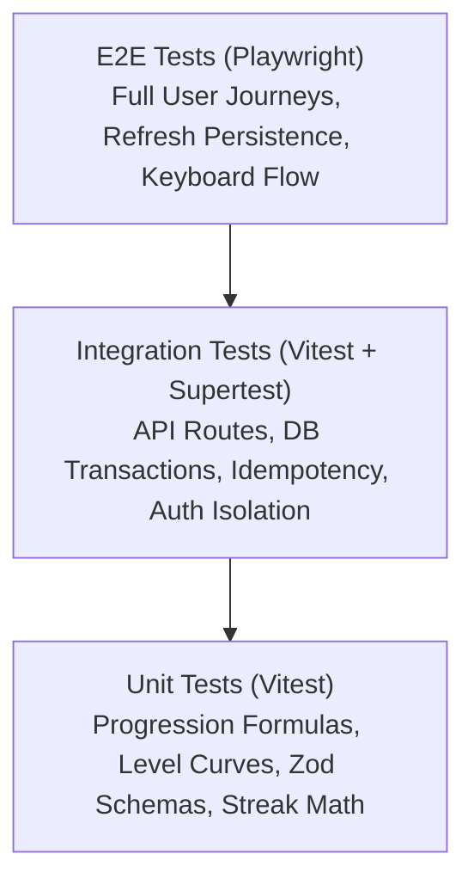

# LIFE-RPG: Quality Assurance & Comprehensive Testing Strategy

> **Document Version:** 1.0.0  
> **Status:** Canonical QA & Testing Strategy  
> **Author:** QA Lead, Security Engineer & Tech Lead  
> **Last Updated:** 2026-09-12  

---

## 1. Quality Assurance Philosophy & Principles

The testing strategy of Life-RPG centers on one foundational premise: **Server-Authoritative Trust & Resilience**.

Because Life-RPG is an RPG progression system, data integrity is paramount:
1. **Mathematical Invariance:** XP, Gold, Level boundaries, and Attribute distributions must be mathematically sound under all conditions.
2. **Zero-Trust Client Perimeter:** Forged client payloads, race conditions, and manipulated requests must be rejected at the API boundary without side-effects.
3. **Flawless Persistence:** Every user action must durably commit to the PostgreSQL database so that page reloads, browser crashes, or multi-device switches reflect exact authoritative state.

---

## 2. Testing Pyramid & Tooling Suite



| Testing Layer | Primary Tooling | Coverage Target | Focus Areas |
| :--- | :--- | :--- | :--- |
| **Unit Tests** | **Vitest** | $\ge 95\%$ | Mathematical progression functions, level curves, momentum algorithms, Zod validation schemas. |
| **Integration Tests** | **Vitest + Prisma Mock / Test DB** | $\ge 90\%$ | API Route Handlers, database transactions, row-level locking, duplicate completion prevention, shop purchases. |
| **End-to-End (E2E)** | **Playwright** | Critical User Paths | Signup $\to$ Quest Creation $\to$ Completion $\to$ Level Up $\to$ Hard Page Refresh $\to$ Shop Purchase. |
| **Accessibility** | **@axe-core/playwright + Lighthouse** | Score $\ge 95$ | Keyboard navigation (`Tab`/`Enter`/`Space`), ARIA roles, focus rings, contrast ratios, `prefers-reduced-motion`. |
| **Performance** | **Google Lighthouse CI** | Score $\ge 90$ | Core Web Vitals (LCP $<1.2\text{s}$, CLS $0.00$, INP $<80\text{ms}$), bundle optimization. |

---

## 3. Critical Security & Edge-Case Test Scenarios

`[SOURCE REQUIREMENT] & [TECHNICAL DECISION]`

### 3.1 Test Case SEC-01: Client Reward Tampering Attempt
- **Description:** A malicious user intercepts the `POST /api/v1/tasks/:id/complete` request and attempts to send forged reward fields:
  ```json
  { "xp": 999999, "gold": 999999, "level": 99 }
  ```
- **Expected Outcome:** The API completely ignores all client body fields. The backend fetches the task from the database, inspects its authoritative `difficulty` tier, awards strictly the pre-configured base reward (e.g., +50 XP, +25 GP), and writes an authoritative entry to `xp_transactions`. Tampering has **zero effect**.

### 3.2 Test Case SEC-02: Tenant Data Isolation & Cross-Account Access
- **Description:** User B attempts to access or mutate User A's task:
  - `GET /api/v1/tasks/user_a_task_id`
  - `POST /api/v1/tasks/user_a_task_id/complete`
  - `DELETE /api/v1/tasks/user_a_task_id`
- **Expected Outcome:** All queries include `WHERE id = $taskId AND user_id = $sessionUserId`. The API returns `404 Not Found` or `403 Forbidden`. User B cannot read or corrupt User A's data.

### 3.3 Test Case CONC-01: Double-Click & Rapid Simultaneous Completion
- **Description:** The user rapidly clicks "Complete" twice within 50ms, or two browser tabs simultaneously fire completion requests for the same `taskId`.
- **Expected Outcome:**
  - Request 1 enters the transaction, marks `status = 'COMPLETED'`, writes to `task_completions`, and awards XP/Gold.
  - Request 2 encounters either the `UNIQUE(task_id)` constraint or sees `status == 'COMPLETED'`, immediately aborting with `409 Conflict`.
  - Result: **XP and Gold are awarded exactly once.**

### 3.4 Test Case CONC-02: Insufficient Funds & Currency Race Condition
- **Description:** A user with 100 Gold fires two simultaneous requests to purchase a 100 Gold item in the shop.
- **Expected Outcome:** The database utilizes `SELECT gold FROM profiles WHERE user_id = $1 FOR UPDATE`. Request 1 succeeds and deducts 100 Gold. Request 2 reads `gold == 0` and is rejected with `422 Unprocessable Entity (INSUFFICIENT_GOLD)`. Negative balances are strictly impossible.

### 3.5 Test Case PERS-01: Database Persistence Verification (Zero-Tolerance Rule)
- **Description:** 
  1. User signs up and logs in.
  2. Creates a task *"Read 20 pages of Clean Code"*.
  3. Completes the task, receiving +50 XP and +25 Gold.
  4. User presses `Ctrl+F5` (Hard Page Reload) to clear all browser memory.
- **Expected Outcome:** The dashboard immediately displays the persisted state: Total XP: 50, Gold: 25, Task marked as completed. Data is retrieved from PostgreSQL, proving that primary storage is **not** reliant on `localStorage`.

---

## 4. Automated Test Implementation Examples

### 4.1 Unit Test: Progression Curve Math (`src/__tests__/progression.test.ts`)
```typescript
import { describe, it, expect } from "vitest";
import { 
  calculateXpForLevel, 
  calculateLevelFromTotalXp, 
  calculateAttributeLevel 
} from "../lib/progression";

describe("RPG Progression Mathematical Engine", () => {
  it("calculates correct non-linear XP thresholds for levels", () => {
    // Level 1 -> 2: floor(100 * 1^1.5) = 100
    expect(calculateXpForLevel(1)).toBe(100);
    // Level 2 -> 3: floor(100 * 2^1.5) = 282
    expect(calculateXpForLevel(2)).toBe(282);
    // Level 3 -> 4: floor(100 * 3^1.5) = 519
    expect(calculateXpForLevel(3)).toBe(519);
  });

  it("calculates correct level based on cumulative XP", () => {
    expect(calculateLevelFromTotalXp(0)).toBe(1);
    expect(calculateLevelFromTotalXp(99)).toBe(1);
    expect(calculateLevelFromTotalXp(100)).toBe(2);
    expect(calculateLevelFromTotalXp(381)).toBe(2);
    expect(calculateLevelFromTotalXp(382)).toBe(3);
  });

  it("calculates independent attribute levels smoothly", () => {
    expect(calculateAttributeLevel(0)).toBe(1);
    expect(calculateAttributeLevel(100)).toBe(2);
    expect(calculateAttributeLevel(500)).toBe(3);
  });
});
```

### 4.2 Integration Test: Task Completion Endpoint (`src/__tests__/api/tasks.test.ts`)
```typescript
import { describe, it, expect, beforeEach } from "vitest";
import { prisma } from "../../lib/db";
import request from "supertest";
import { app } from "../../app";

describe("POST /api/v1/tasks/:id/complete", () => {
  let testUserId: string;
  let testTaskId: string;
  let sessionCookie: string;

  beforeEach(async () => {
    // Clean and seed test user and task
    const user = await prisma.user.create({
      data: {
        email: `test_${Date.now()}@liferpg.dev`,
        profile: { create: { username: `Hero_${Date.now()}`, totalXp: 0, gold: 0 } },
        attributes: { create: { attributeCode: "INT", currentXp: 0, currentLevel: 1 } }
      },
      include: { profile: true }
    });
    testUserId = user.id;

    const task = await prisma.task.create({
      data: {
        userId: testUserId,
        title: "Test Quest",
        attributeCode: "INT",
        difficulty: "Medium",
        xpReward: 50,
        goldReward: 25,
        status: "ACTIVE"
      }
    });
    testTaskId = task.id;
    sessionCookie = createMockAuthCookie(testUserId);
  });

  it("awards exact XP and Gold and marks task completed", async () => {
    const res = await request(app)
      .post(`/api/v1/tasks/${testTaskId}/complete`)
      .set("Cookie", sessionCookie)
      .send({});

    expect(res.status).toBe(200);
    expect(res.body.success).toBe(true);
    expect(res.body.data.awardedXp).toBe(50);
    expect(res.body.data.awardedGold).toBe(25);

    // Verify database state directly
    const updatedProfile = await prisma.profile.findUnique({ where: { userId: testUserId } });
    expect(updatedProfile?.totalXp).toBe(50);
    expect(updatedProfile?.gold).toBe(25);

    const updatedTask = await prisma.task.findUnique({ where: { id: testTaskId } });
    expect(updatedTask?.status).toBe("COMPLETED");
  });

  it("rejects duplicate completion with 409 Conflict", async () => {
    // First completion
    await request(app)
      .post(`/api/v1/tasks/${testTaskId}/complete`)
      .set("Cookie", sessionCookie)
      .send({});

    // Second duplicate attempt
    const res = await request(app)
      .post(`/api/v1/tasks/${testTaskId}/complete`)
      .set("Cookie", sessionCookie)
      .send({});

    expect(res.status).toBe(409);
    expect(res.body.error.code).toBe("TASK_ALREADY_COMPLETED");
  });
});
```

---

## 5. Walkthrough Video & Final Submission Checklist

`[SOURCE REQUIREMENT]`

Prior to project submission, the following verification checklist must be rigorously validated against the production deployment:

- [ ] **Duration Compliance:** Video length is **strictly between 90 and 180 seconds** (1:30 to 3:00).
- [ ] **File Size Compliance:** Video file size is **under 100 MB**.
- [ ] **Story Flow Verification:**
  1. `[0:00 - 0:20]` User signs up / logs into account.
  2. `[0:20 - 0:45]` User creates a new quest with attribute tag (`INT`) and difficulty (`Medium`).
  3. `[0:45 - 1:15]` User completes the quest; UI shows tactile audio, confetti, XP/Gold increment, and Level-Up trigger.
  4. `[1:15 - 1:40]` **Crucial:** User refreshes the browser (`Cmd+R` / `F5`) demonstrating that all XP, Gold, and task states **persist in the database**.
  5. `[1:40 - 2:30]` Showcase of signature differentiator: Real-Life Boss Battle milestone completion OR AI Game Master campaign generation.
- [ ] **Public Accessibility:** Walkthrough video is uploaded to an open, publicly accessible URL (YouTube Unlisted, Loom, or direct repo file) requiring **zero login or permission authorization**.
- [ ] **Git Repository Validation:** Public repository contains **at least 3 chronological commits**, comprehensive `README.md`, and `.env.example`.
- [ ] **Runtime Stability:** Zero console errors, unhandled rejections, or blank-screen crashes during test runs.
